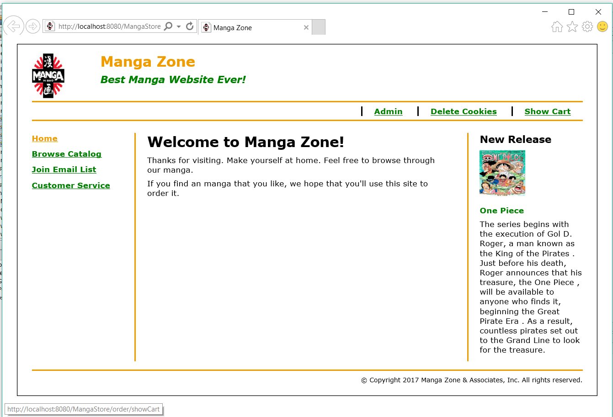
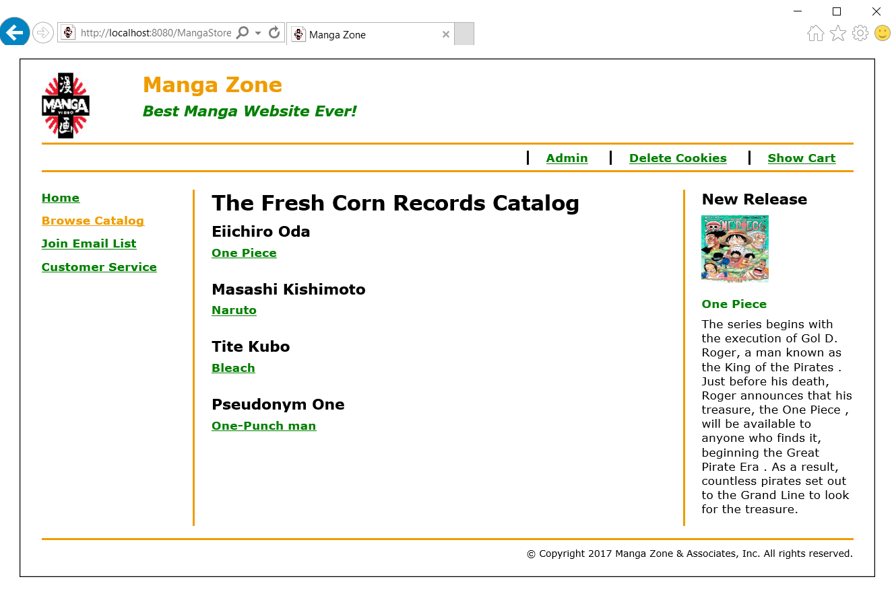
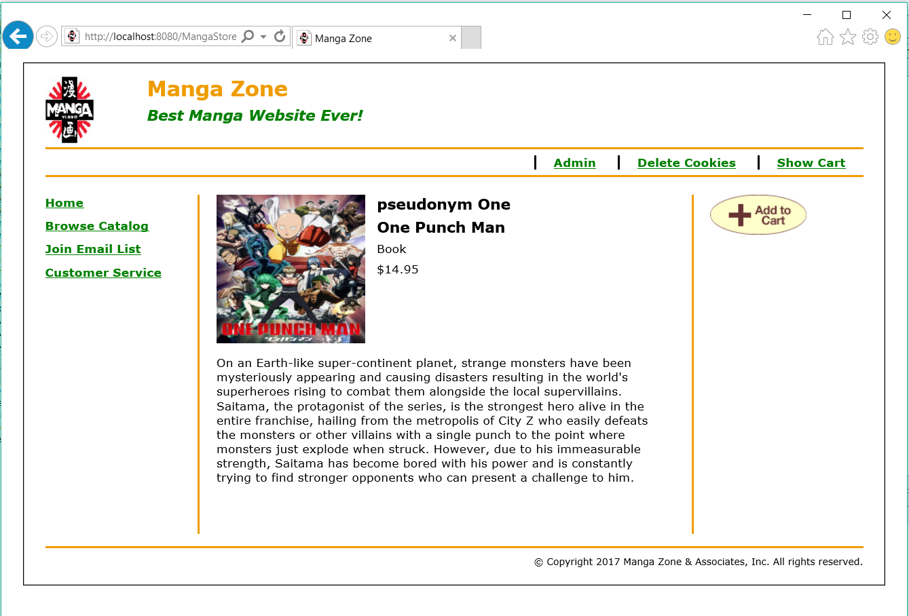
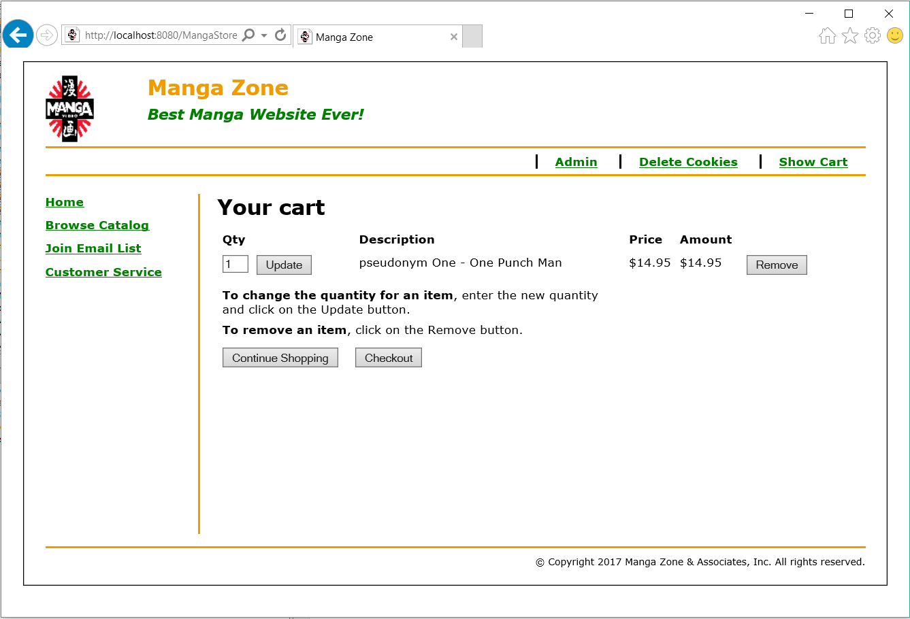
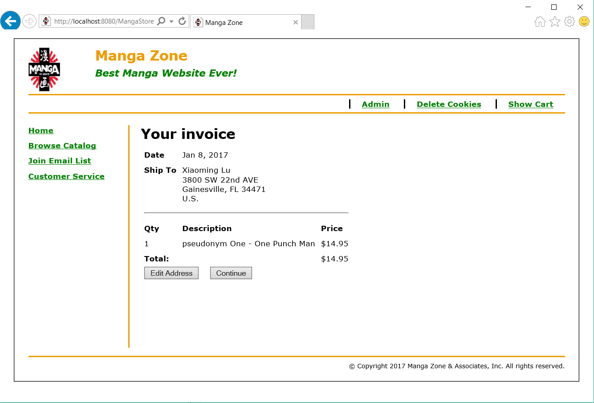
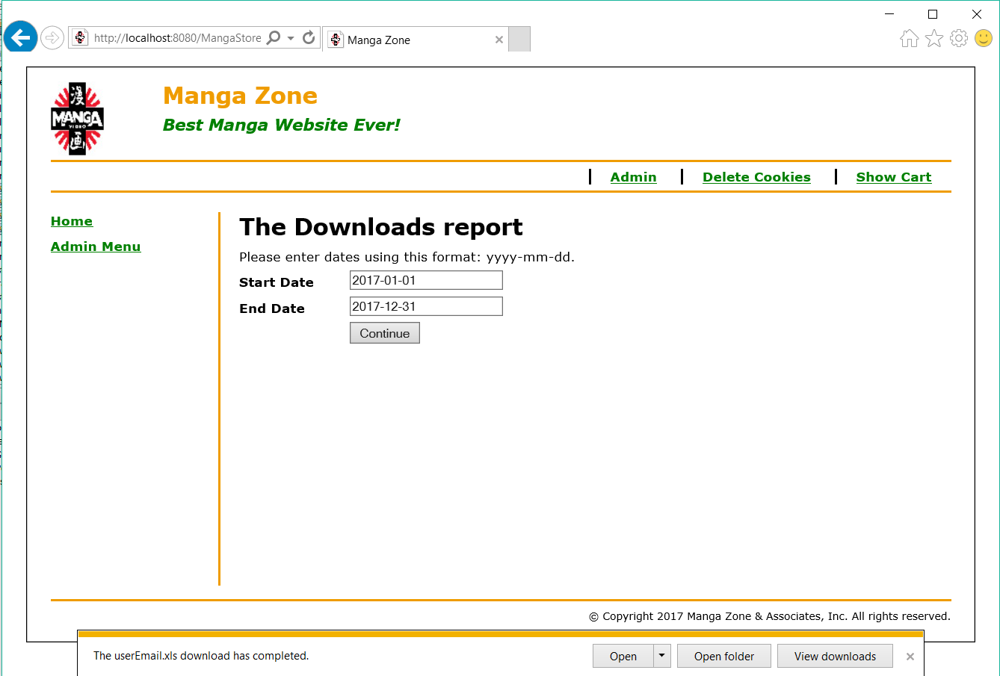
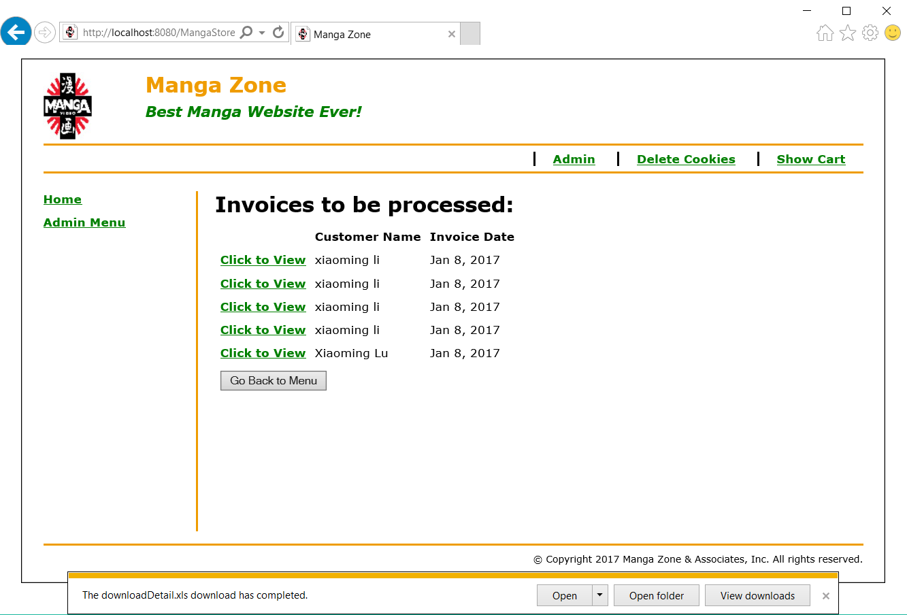

# Web_MangaStore
It is a Manga Shopping Website which is built based on MVC pattern. I used JSP and html to implement the View layer,Java Servelet 
to implement the Controller layer, and Java Bean to implement the Model layer. The database I used was MySQL and I used java's JDBC 
to communicate between web and database.

